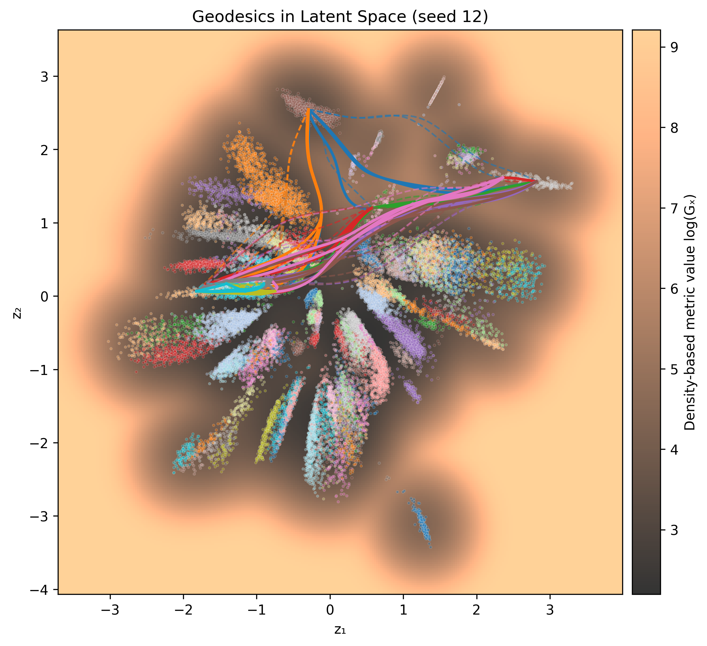
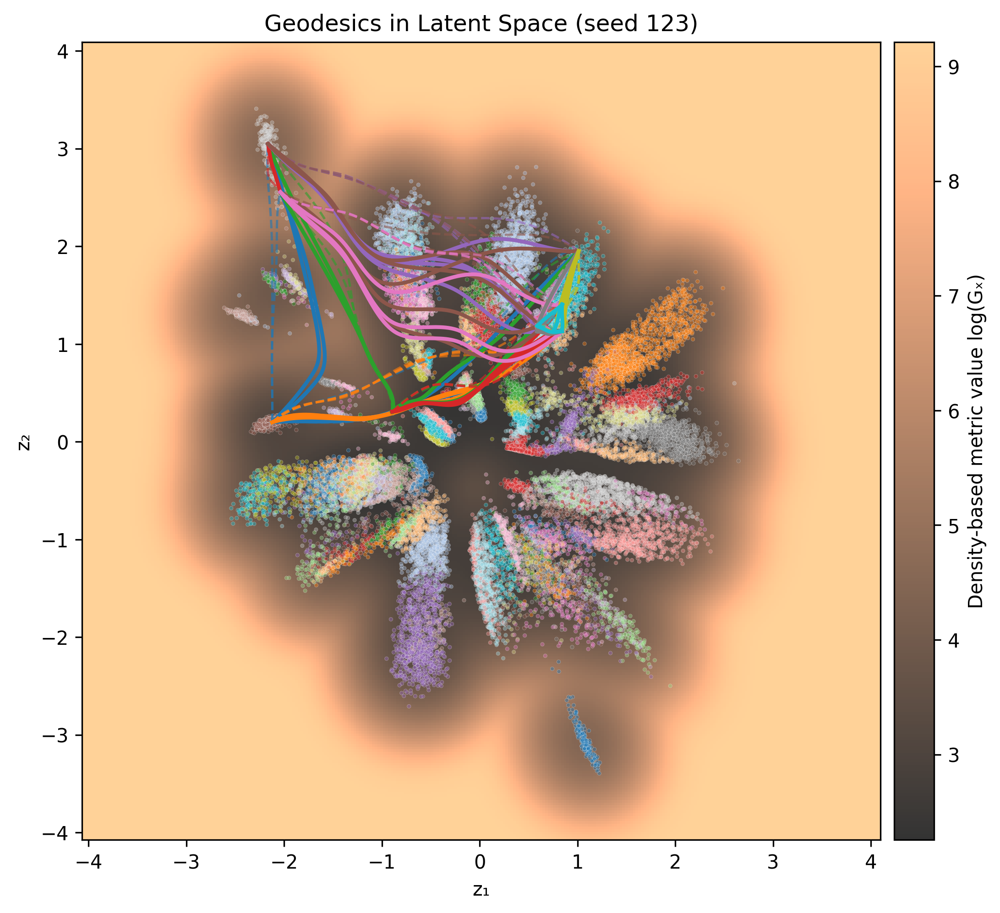
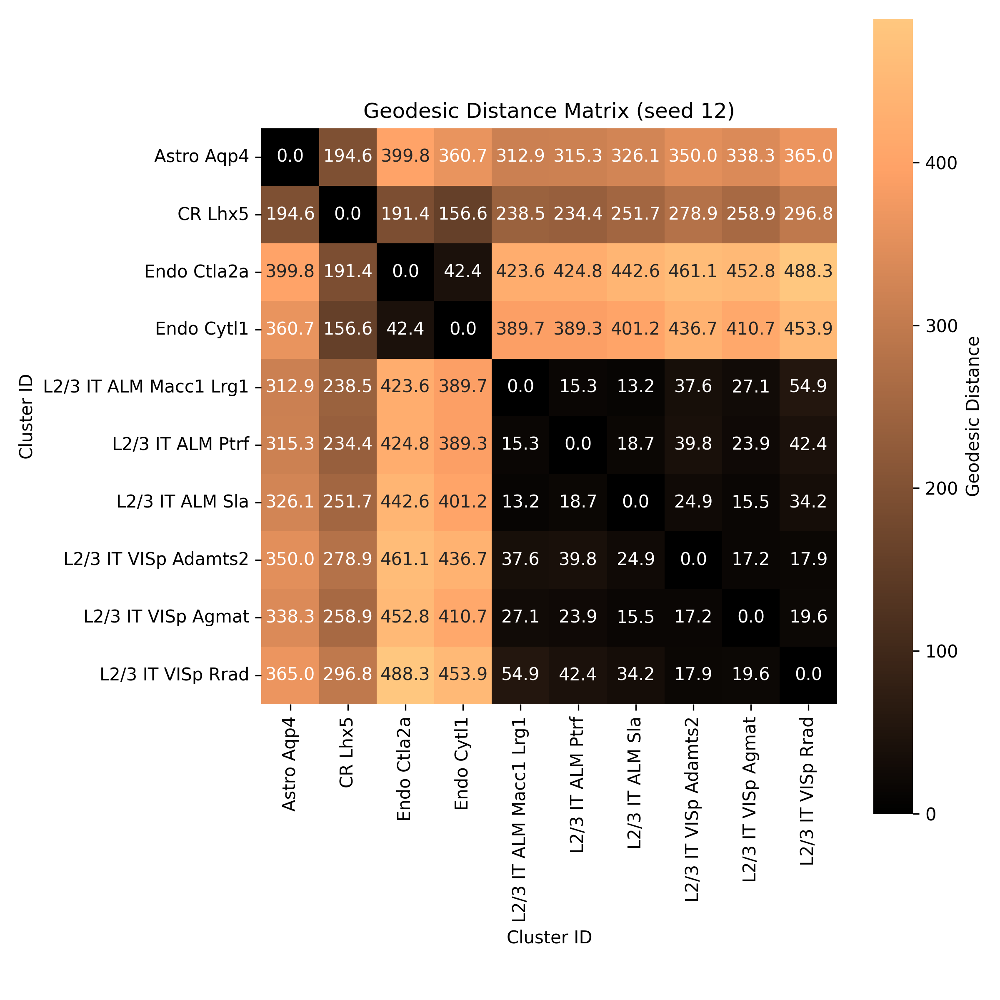
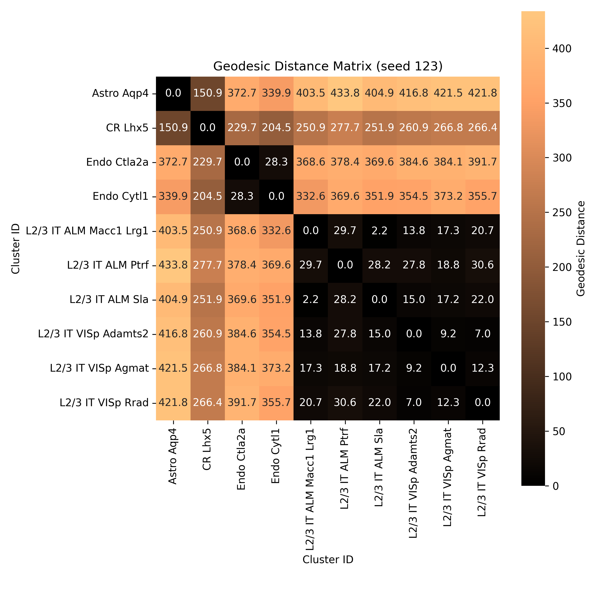

# vae-latent-geometry

## Computing Identifiable Distances at a Large Scale

Aim of producing geodesics in regard to this project by Syrota et al.: https://github.com/mustass/identifiable-latent-metric-space

**Aim**: Implementing algorithms at large scale for approximating distances between points. 

**Data**: Obtained from here (pre-processed): https://github.com/berenslab/rna-seq-tsne/tree/master/data/tasic-preprocessed

Geodesics: Single decoder (initial pipeline):
* dir src/single_decoder/ (batched!? not yet)
    * init_spline.py => spline_batch_seedX.pt
    * optimize_energy.py => spline_batch_optimized_seedX.pt 
    * density.py => geodesic_distances_seedX.json

Call src/single_batched.sh

Output visuals src/plots/single_decoder/. Examples below:

<table>
  <tr>
    <td></td>
    <td></td>
  </tr>
  <tr>
    <td></td>
    <td></td>
  </tr>
</table>

The numerical similarity should be more similar... Therefore, we do geodesic ensemble approximations further.

Geodesics: Ensemble (structure):
* dir src/ (should be batched!)
    * select_representative_pairs.py => selected_pairs.json. Samples one point from n_max different classes (bound 133 unique).
    * 

Call src/....sh