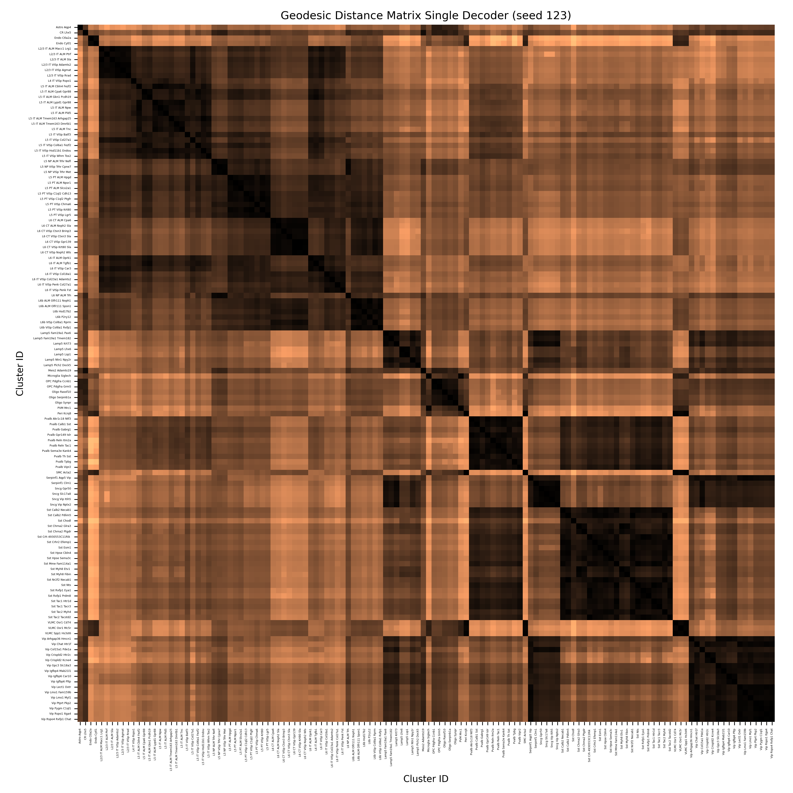

# vae-latent-geometry

## Computing Identifiable Distances at a Large Scale

Aim of measuring geodesics. Inspired by this project by Syrota et al.: https://github.com/mustass/identifiable-latent-metric-space

**Aim**: Implementing algorithms at large scale for approximating distances. 

**Data**: Obtained from here (pre-processed): https://github.com/berenslab/rna-seq-tsne/tree/master/data/tasic-preprocessed

Geodesics: Single decoder (initial pipeline):
* dir src/single_decoder/ 
    * src/select_representative_pairs.py => selected_pairs.json. Samples one point from n_max different classes (bound 133 unique).
    * init_spline.py => spline_batch_seedX.pt
    * optimize_energy.py => spline_batch_optimized_seedX.pt 
    * density.py => geodesic_distances_seedX.json (Visualizing stuff)

Call src/single_batched.sh

Output visuals src/plots/single_decoder/. Examples below:

<table>
  <tr>
    <td></td>
    <td></td>
  </tr>
  <tr>
    <td></td>
    <td></td>
  </tr>
</table>

The numerical similarity was hypothesized to be more similar... Therefore, we train ensemble VAEs to do geodesic approximations.

Geodesics: Ensemble (not done!):
* dir src/ 
    * select_representative_pairs.py => selected_pairs.json. Samples one point from n_max different classes (bound 133 unique).
    * train evaes train.py
        * python -m src.train --seed 456 --save-dir experiment --num-decoders 10 --device cuda --epochs 600
    * python -m src.init_splines_ensemble --model-path experiment/model_seed12.pt --pairfile experiment/pairs/selected_pairs_10.json --n-poly 4
    * python -m src.optimize   --model-path experiment/model_seed12.pt   --init-type euclidean   --pair-count 10   --steps 1000   --batch-size 200
    * eval.py to obtain distance matrices (also possible to run CV analysis here)
        * python -m src.eval --mode matrix --init-type euclidean --pair-count 133 --seed 123
        * python -m src.eval --mode cov --pair-count 15 --seeds 12 123 1234 12345
